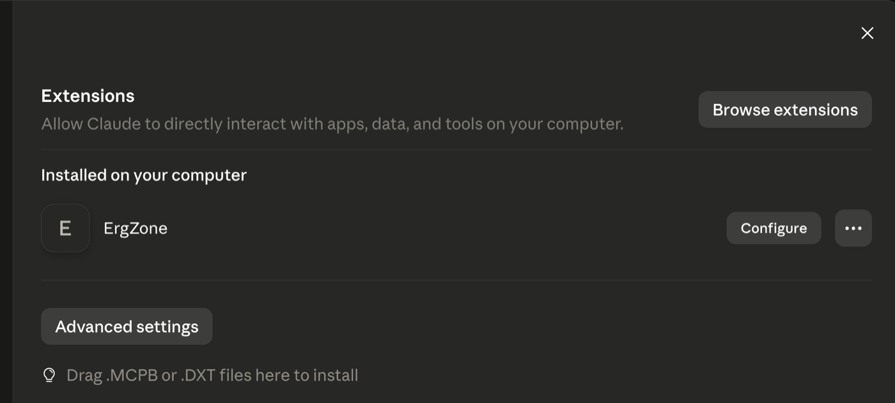
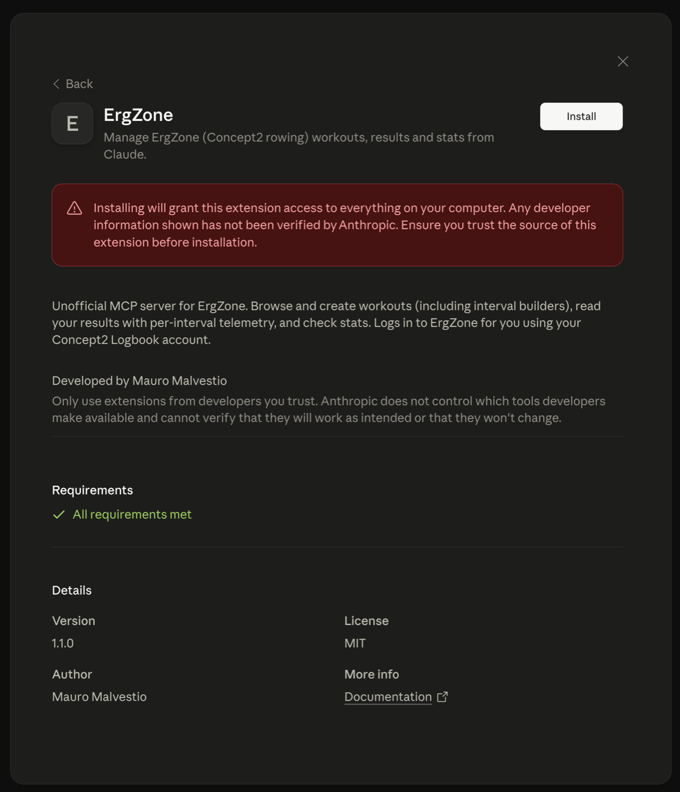
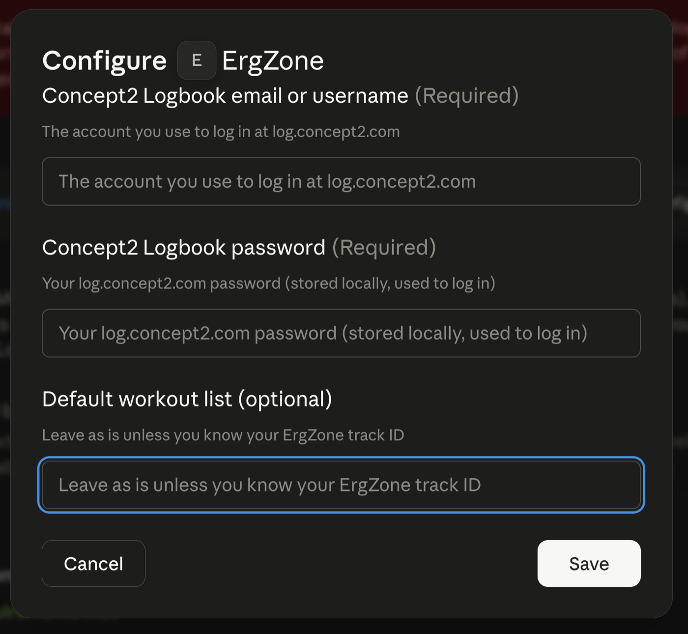
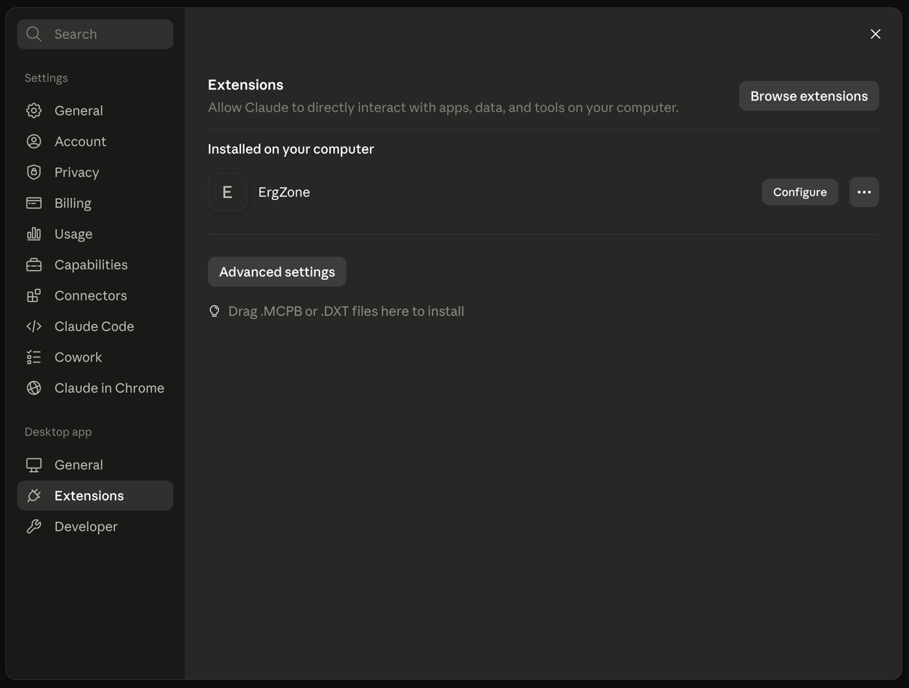
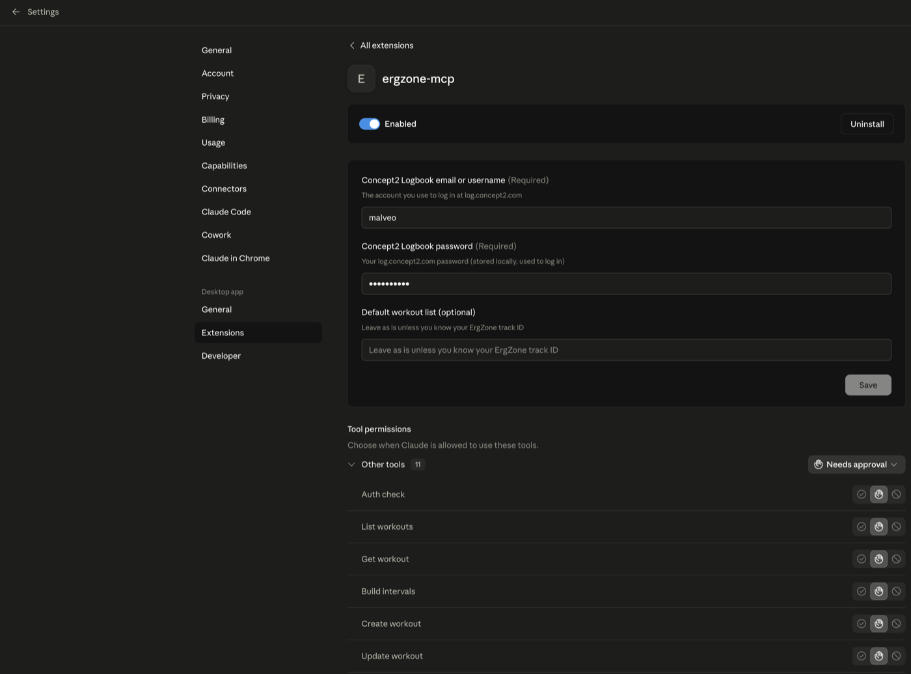

# Set up ErgZone in Claude Desktop

A step-by-step guide to install and configure the ErgZone extension (`.mcpb`) in Claude Desktop. No terminal, no Node, no config files.

## 1. Open Extensions

In Claude Desktop go to **Settings → Extensions** (under "Desktop app").

## 2. Install the bundle

Download `ergzone-mcp.mcpb` from the [latest release](https://github.com/malveo/ergzone-mcp/releases/latest), then **drag it onto the Extensions window** (or double-click the file).

You'll see a confirmation screen. Because it's a third-party extension, Claude warns that it can access your computer — install only if you trust the source. Click **Install**.

After installing, ErgZone appears under **Installed on your computer**.

## 3. Enter your Concept2 Logbook credentials

Click **Configure** and fill in:

- **Concept2 Logbook email or username** — the account you use at log.concept2.com
- **Concept2 Logbook password** — stored locally, used to log in for you
- **Default workout list** — leave empty unless you know your ErgZone track ID

Click **Save**.

## 4. Enable the extension

Make sure the **Enabled** toggle is **on**. This is required — if it's off, the server never starts and no tools appear.

## 5. (Optional) Tool permissions

Lower on the same page you can choose when Claude may use each tool (allow / ask / deny). Defaults to "ask" — fine to leave as is.

## 6. Try it

Start a new chat and ask, for example:

> Am I connected to ErgZone? Who am I?

If it replies with your name, you're set. See more [example prompts](../README.md#example-prompts).

---

### Troubleshooting

- **No ErgZone tools in chat** → the extension is probably disabled (step 4) or the credentials aren't saved (step 3).
- **"Token expired / login failed"** → re-check the Logbook password in Configure.
- **`list_workouts` says no track** → fill the **Default workout list** field with your ErgZone track ID, or just ask Claude to find your "My Workouts" track.
